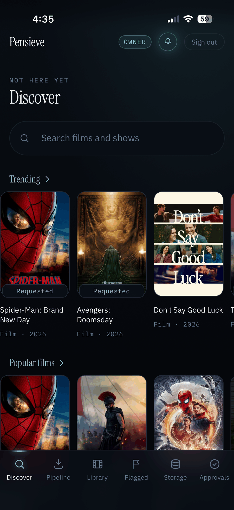
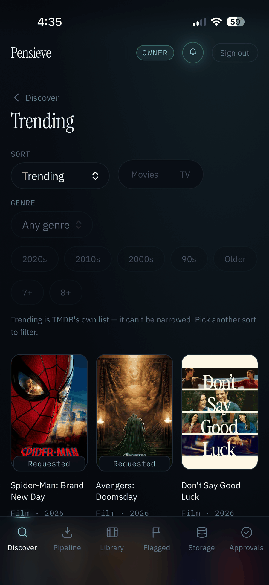
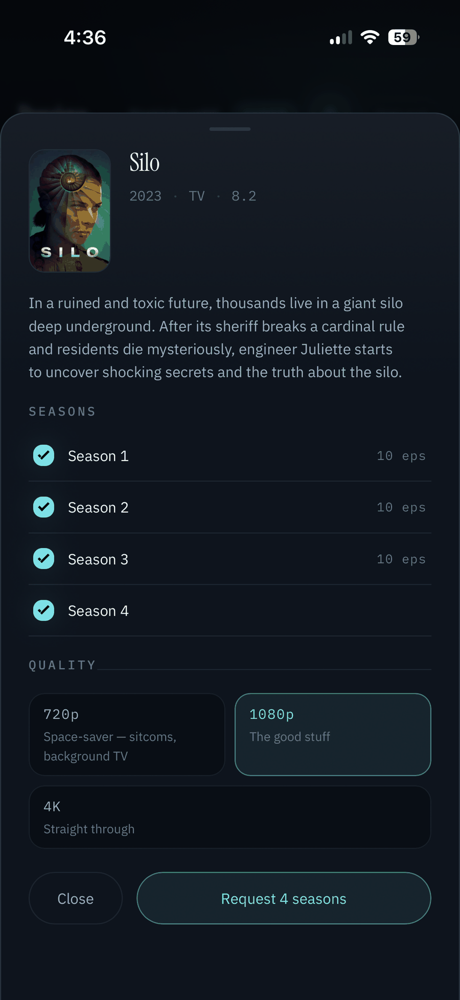
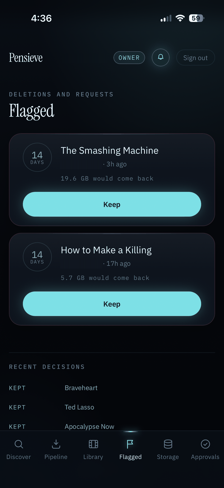
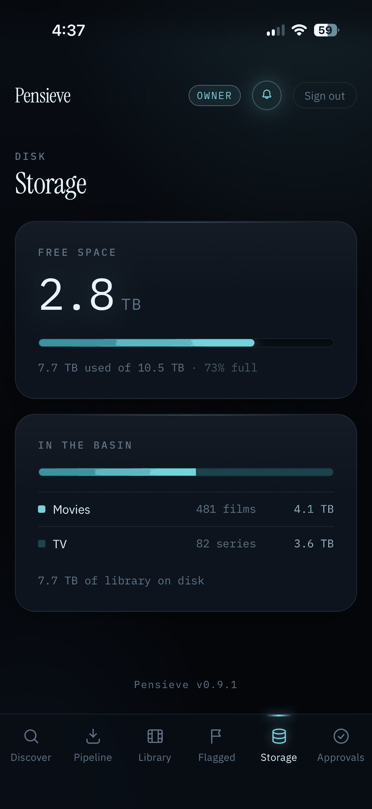
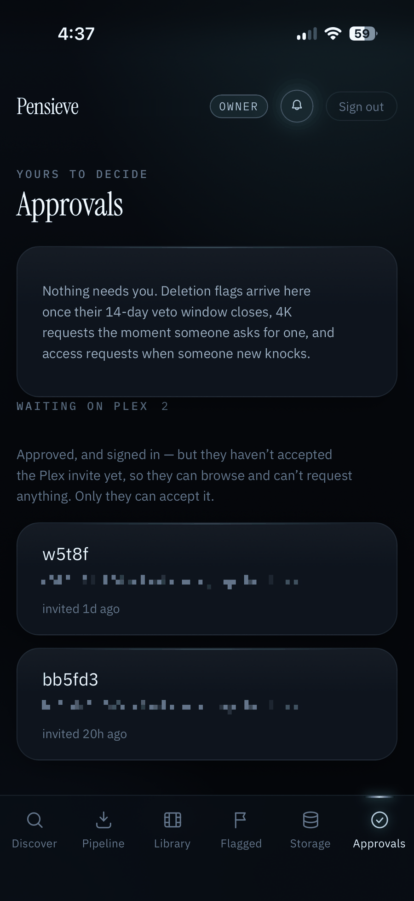

# Quorarr

**Shared library governance for Plex — run your media server like a small commons.**

Quorarr is a small self-hosted web app (installable as a PWA) that sits in front of your
Plex server and gives the people you share with a *say* in it — not just a request box.
They can find something and ask for it, propose that something be deleted, argue about it
for two weeks, and pick how much disk a show is worth. You keep the final word on
everything that costs real money: 4K, and anything that removes files.

---

## The gap this fills

Most shared Plex servers are run by one person with a request tool bolted on. Everything
that isn't "please add this" — *this is taking 400 GB and nobody has watched it in a year*,
*does anyone still care about season 3*, *can this be 4K* — happens in a group chat, or it
doesn't happen at all. So libraries only ever grow, and the owner is the only one who ever
has to think about the disk.

Quorarr's premise is that the people using the library can be trusted with more than a
request button, as long as destructive actions are slow, visible, and reversible until the
last step.

|                              | Overseerr / Jellyseerr | Maintainerr | removarr | **Quorarr** |
| ---------------------------- | ---------------------- | ----------- | -------- | ----------- |
| Members request new media    | ✅ (its whole job)      | ❌           | ❌        | ✅ (via Jellyseerr) |
| Members propose deletions    | ❌                      | ❌           | ✅        | ✅ |
| Veto / objection window      | ❌                      | ❌           | partial (votes) | ✅ 14-day veto, any member |
| Owner is final approver      | ✅ (on requests)        | ❌ (rules act on their own) | ❌ | ✅ (on deletion + 4K) |
| Rule-driven automatic cleanup| ❌                      | ✅ (its whole job) | ❌ | ❌ (deliberately — people decide, not rules) |
| Per-member quality tiers     | ❌                      | ❌           | ❌        | ✅ 720p / 1080p self-serve, 4K gated |
| Storage picture for members  | ❌                      | ❌           | ❌        | ✅ |
| Access requests from strangers| ❌                     | ❌           | ❌        | ✅ (approve → plex.tv share) |
| Identity model               | local users / Plex OAuth| n/a         | n/a      | Plex OAuth only |

Quorarr does **not** replace Jellyseerr — it drives it. Requests are filed into Jellyseerr
via its API, attributed to the requesting person's own Jellyseerr user, so your existing
request history, quotas, and notifications keep working. It doesn't replace Maintainerr
either: if you want a rule engine that reclaims disk on a schedule, use Maintainerr.
Quorarr is the opposite instinct — deletions come from people, and they take two weeks.

---

## Feature tour

### Discover and requests

Trending / Popular / Coming soon shelves plus a search box, all served from Jellyseerr's
index. TV titles get a season picker showing what's already on the server and what has
already been requested.

Tapping a shelf title opens a **browse view** for that shelf: endless scroll with filters
for genre, minimum rating, release year and sort order. Filters map onto Jellyseerr's
discover parameters, so the results are the same ones Jellyseerr would give you.

The important part is attribution. Quorarr knows a member by their Plex account id;
Jellyseerr wants its own user id on `POST /request`. If that mapping fails, the request is
**refused**, never filed under the API key's owner — a silently misattributed request wears
the wrong name forever and eats the wrong person's quota. Quorarr will try to import the
account from Plex once, then give up loudly.

Every request carries an explicit quality profile id. There is no path to "whatever the
Jellyseerr/arr default happens to be today".

Requests are capped at 20 per member per hour.

### Deletion: flag → 14-day veto → owner approval

Any member can flag a movie, a series, or a single season, with a reason. That flag is
visible to everyone.

- For **14 days**, any other member can veto it. One veto closes it — no tally, no quorum.
  A vetoed or denied item can't be re-flagged for 30 days, so nobody can grind a title down
  by re-proposing it every week.
- If nobody objects, the flag moves to the owner's approval queue (a background sweep runs
  hourly, and also opportunistically whenever anyone loads the flags view).
- Only the owner's approval actually calls Radarr/Sonarr and removes files.

Titles and sizes are resolved server-side from the Radarr/Sonarr id, never trusted from the
client — otherwise a crafted request could have the owner approving one film while a
different file came off the disk.

### Tiered quality: self-serve up to 1080p, 4K is the owner's valve

Quality is chosen from a fixed vocabulary (`720p`, `1080p`, `4K`) that maps to quality
profile ids *you* configure. Clients never send a profile id.

- **1080p** — self-serve. On an existing item it switches the profile and triggers a search
  immediately.
- **720p** — self-serve, TV only, and only if you've configured a 720p Sonarr profile. The
  "space-saver" lane for sitcoms and background TV. If the lane isn't configured, the
  request fails with a clear error rather than quietly filing at 1080p.
- **4K** — the owner's request goes straight through; anyone else's becomes a pending row
  and *nothing* reaches Jellyseerr until the owner decides. Denying a 4K ask **still files
  the title at 1080p** — "no" is a decision about size, not about whether someone gets to
  watch the thing. Dropping the request entirely would leave a friend waiting on a download
  that was never coming.
- Downgrades are refused: asking for 1080p on an item already at 4K would switch the profile
  down and re-search, which can replace the existing file on import. For the same reason a
  film already sitting at 4K is not offered a 4K "upgrade" — there is nothing to upgrade to,
  and the ask would only cost the owner an approval.

### Library, storage and pipeline views

- **Library** — browse movies and series from Radarr/Sonarr, with per-season quality mix on
  the series detail view.
- **Storage** — disk usage for the media mount plus a movies/TV breakdown. If an arr is
  unreachable, the view degrades to the last cached figures with an explicit "as of" rather
  than failing.
- **Pipeline** — Jellyseerr requests joined against the Radarr/Sonarr download queues, so
  "where is my show" has an answer that isn't "ask the owner".

### Access requests

A Plex account with no share on your server hits the login screen and gets an honest dead
end — plus a "request access" button. That path issues a short-lived, signed guest cookie
that grants nothing except the ability to file (and read) that one account's own request.

Approving it in the owner's queue calls the plex.tv share API to invite the account onto
every library section, and creates the member row. Approving happens before anything is
written locally, so a plex.tv failure leaves the request retryable instead of marking
someone "approved" who can't actually sign in.

Approval alone gets someone into Quorarr, which means there is a real "half-in" state: an
approved member who has not yet accepted the Plex invite email. They can browse everything
and successfully request nothing, because Jellyseerr has no user for them yet. Quorarr names
that state on both sides — the member gets a card telling them to accept the invite (and a
request attempt says so rather than failing obscurely), and the owner's approvals view lists
who is still waiting on Plex.

An hourly reconcile walks your Plex share list and revokes anyone Plex no longer shares
with — so "remove their Plex share" also means "remove their Quorarr access". It fails
closed: if the share list can't be read, the tick is skipped rather than treating "I don't
know" as "nobody has access".

### Web push and PWA

Notifications go to the app, not to a chat channel. The PWA registers a Web Push
subscription (VAPID) and owner-facing events fall back to a Discord webhook only when the
push didn't actually land — measured on delivery count, not on whether a subscription
exists.

Installable to the Home Screen on iOS and Android. **On iOS, Web Push only works from an
installed copy**, so the notification bell is replaced by install instructions until then.
The service worker never caches `/api` or `/auth` — the whole job of this app is reporting
live state.

---

## Screenshots

| Discover | Browse (Trending, filtered) | Request sheet (seasons + quality) |
| -------- | ---------------------------- | ---------------------------------- |
|  |  |  |

| Flagged / veto | Storage | Owner approvals |
| --------------- | ------- | ---------------- |
|  |  |  |

Screenshots from the author's own deployment, branded "Pensieve" via `APP_NAME`.

---

## Requirements

| Component | Required? | Why |
| --------- | --------- | --- |
| **Plex Media Server** | Yes | Identity (OAuth), the share list, and the access-request invites. |
| **Jellyseerr** | Yes | Discover shelves, search, title detail, and every request. Quorarr has no request engine of its own. |
| **Radarr** | Yes | Movie library, sizes, profile switches, deletions. |
| **Sonarr** | Yes | Series/season library, sizes, profile switches, deletions. |
| **A reverse proxy with TLS** | **Yes — see below** | |
| Discord webhook | Optional | Fallback when a push doesn't land. |
| VAPID keypair | Optional | Without it, push is disabled and owner events go to Discord only. |

### ⚠️ A TLS reverse proxy is not optional

Read this before you deploy.

1. **Session cookies are issued with `Secure`.** Over plain HTTP, sign-in does not work at
   all — the browser will not store the cookie.
2. **The container publishes no port, and should not.** The image ships
   `FORWARDED_ALLOW_IPS=*`, which tells uvicorn to trust `X-Forwarded-For` from *whatever*
   connects to it. That is correct when the only thing that can reach it is your proxy on an
   internal Docker network, and it is **wrong the moment you publish the port**: the login
   rate limiter keys on the client IP, and a spoofable header defeats it. Do not add a
   `ports:` mapping to reach it directly — put the proxy on the same Docker network and
   proxy to `quorarr:8000`. If you must expose it more widely, narrow the trust to your
   proxy's address by setting `FORWARDED_ALLOW_IPS` to that IP or CIDR.
3. **Plex OAuth redirects back to `BASE_URL`.** It must be the exact public HTTPS origin
   users reach the app on.

`docs/setup-guide.md` has working Caddy, nginx, and Traefik snippets.

---

## Quick start

```bash
# 1. Get the example files
curl -O https://raw.githubusercontent.com/jordanhoelscher/quorarr/main/docker-compose.example.yml
curl -O https://raw.githubusercontent.com/jordanhoelscher/quorarr/main/.env.example
mv docker-compose.example.yml docker-compose.yml
mv .env.example quorarr.env

# 2. Fill in quorarr.env — every value is explained inline, and
#    docs/setup-guide.md walks through where each one comes from.
$EDITOR quorarr.env
chmod 600 quorarr.env

# 3. Start it
docker compose up -d

# 4. Confirm it booted (no published port, so ask the container)
docker exec quorarr python3 -c \
  "import urllib.request;print(urllib.request.urlopen('http://localhost:8000/health').read())"
```

Then point your reverse proxy at `quorarr:8000` and open the site. The first account to sign
in whose Plex account id matches `PLEX_OWNER_ACCOUNT_ID` becomes the owner; everyone else
who has a share on your server becomes a member.

**Upgrading is `docker compose pull` + `up -d`.** Schema migrations run automatically at
startup and are stamped into the database file itself — back up `pensieve.db` first, and see
`docs/upgrading.md`.

**Quorarr refuses to boot on a half-configured deploy.** A missing required variable, or a
quality-profile id of `0`, is a startup error rather than a runtime surprise — filing
requests against profile id `0` would silently land them wherever the arr felt like.

---

## Configuration reference

All configuration is environment variables. Names are case-insensitive; the table uses the
conventional uppercase form.

### Required

| Variable | Example | Notes |
| -------- | ------- | ----- |
| `SESSION_SECRET` | `openssl rand -hex 32` | Signs session, PIN-handshake, and guest cookies. **Minimum 32 characters — a shorter one is a startup error**, because a guessable signing key is a forgeable owner session. Rotating it logs **everyone** out, owner included. Never use it to revoke one person — see the security model below. |
| `BASE_URL` | `https://media.example.com` | Public origin, no trailing slash. Plex OAuth redirects to `<BASE_URL>/auth/callback`, so there is deliberately no default: a wrong value would not error, it would forward a user's freshly minted auth token to somebody else's host. |
| `PLEX_CLIENT_ID` | a stable UUID | Identifies this app to plex.tv. Generate once and keep it — changing it invalidates in-flight logins. |
| `PLEX_SERVER_MACHINE_ID` | 40-char hex | Your server's `machineIdentifier`. This is the login gate: an account with no share on *this* machine id cannot sign in. |
| `PLEX_OWNER_ACCOUNT_ID` | `12345678` | Your numeric plex.tv account id. The account that gets the owner role. |
| `RADARR_API_KEY` | | Settings → General in Radarr. |
| `SONARR_API_KEY` | | Settings → General in Sonarr. |
| `JELLYSEERR_API_KEY` | | Settings → General in Jellyseerr. |
| `RADARR_PROFILE_HD_ID` | `4` | Radarr profile for the 1080p lane. Must be > 0. |
| `RADARR_PROFILE_4K_ID` | `5` | Radarr profile for the 4K lane. Must be > 0. |
| `SONARR_PROFILE_HD_ID` | `4` | Sonarr profile for the 1080p lane. Must be > 0. |
| `SONARR_PROFILE_4K_ID` | `5` | Sonarr profile for the 4K lane. Must be > 0. |

### Optional (with defaults)

| Variable | Default | Notes |
| -------- | ------- | ----- |
| `RADARR_URL` | `http://radarr:7878` | Container-internal URL. |
| `SONARR_URL` | `http://sonarr:8989` | |
| `JELLYSEERR_URL` | `http://jellyseerr:5055` | |
| `SONARR_PROFILE_720_ID` | `0` (lane disabled) | Sonarr's 720p profile. Unset means the 720p option errors instead of silently becoming 1080p. |
| `PLEX_OWNER_TOKEN` | empty | Your own `X-Plex-Token`. Required for **approving access requests** (the plex.tv share call) and for the hourly share reconcile. Without it, approving an access request answers 502. |
| `DISCORD_WEBHOOK_URL` | empty | Fallback channel for owner events when a push didn't land. |
| `VAPID_PUBLIC_KEY` | empty | Web Push. Empty disables push entirely (degrades to Discord). |
| `VAPID_PRIVATE_KEY` | empty | |
| `VAPID_SUBJECT` | empty | Sent to push services (Apple, Google, Mozilla) as the VAPID `sub` claim — a contactable `mailto:` or `https:` for whoever runs this instance. Deliberately has no default, and setting either VAPID key **without** it is a startup error: an unset `sub` is rejected at send time, which would surface as silent non-delivery hours later. |
| `MEDIA_MOUNT` | `/media` | Path inside the container whose filesystem the storage view measures. Mount your library here read-only. |
| `DB_PATH` | `/data/pensieve.db` | SQLite file. Mount `/data` as a volume or you lose members, flags, and push subscriptions on every recreate. The filename keeps the project's original name on purpose — changing the default would silently orphan the database of every deploy that upgraded. Set it explicitly if you want a different one. |
| `FORWARDED_ALLOW_IPS` | `*` (set in the image) | Which upstream addresses uvicorn will trust `X-Forwarded-For` from. `*` assumes the documented deployment: no published port, reachable only through your proxy. Narrow it to the proxy's IP or CIDR if that is not true for you. |
| `STATIC_DIR` | `/app/static` (set in the image) | Built frontend. Leave alone unless you're running the API without the SPA. |

### Branding

The app does not assume it is called Quorarr on your server. Three optional variables
rename it, and the frontend reads them at runtime from `GET /api/config` — so you can
rebrand a published image with an environment variable instead of a rebuild.

| Variable | Default | Purpose |
| -------- | ------- | ------- |
| `APP_NAME` | `Quorarr` | The name everywhere it is shown: page title, splash, header, footer, PWA manifest and Home Screen icon, error copy — and the entry this app gets in each of your friends' Plex **authorized devices** list. |
| `OWNER_NAME` | `the owner` | How member-facing copy refers to whoever approves things: "Sent to ___ for approval", "Awaiting ___", "Needs ___'s sign-off". Every such sentence is written pronoun-free, so a name, a nickname, or the default role word all read correctly. |
| `SERVER_NAME` | empty | An optional subtitle under the wordmark on the login screen — what you call the *server*, as distinct from the app. Empty simply omits the line. |

The two icons (`frontend/public/icons/`) and the favicon are the one piece of branding
configuration cannot reach; replace the files if you want your own mark.

---

## Security model

- **Plex OAuth is the only identity.** No local passwords, no LDAP, no OIDC. Quorarr never
  sees a Plex password — plex.tv does the handshake, and the browser mints its own PIN
  against plex.tv so the "new device signed in" email your friends get names *their*
  address, not your server's.
- **The gate is a share on your server.** A valid Plex account is not enough; the account
  must appear as having a share on `PLEX_SERVER_MACHINE_ID`, or hold an un-revoked member
  row from an approved access request.
- **Sessions are database-authoritative, not cookie-authoritative.** The signed cookie
  proves *identity* only. Role and revocation are re-read from the `users` row on every
  single request. Revoking someone takes effect on their next call — you do not need to
  rotate `SESSION_SECRET` (which would sign out the whole household).
- **Three cookies, three salts.** Session, PIN-handshake, and guest cookies are signed with
  distinct salts off the same secret, so one can never verify as another. The guest cookie
  lives 15 minutes and grants nothing but "file my own access request".
- **4K and deletion are role-gated server-side.** The role comes from the session
  dependency reading the database, never from the request body.
- **Destructive actions are two-key.** A member can propose a deletion; only the owner can
  execute one, and only after the veto window has closed.
- **Upstream errors are sanitized.** Friends see `"<service> unreachable"`; the full
  exception text (which can carry internal hostnames and ports) stays in the database for
  the owner's queue.
- **No API docs surface.** `/docs`, `/redoc`, and `/openapi.json` are disabled — this app is
  internet-facing and fronts an API that deletes files.
- **Login and guest routes are rate-limited** per client IP; requests are capped per account.
- **XML from plex.tv is parsed with `defusedxml`**, and a document that parses but isn't a
  `MediaContainer` (e.g. a proxy's HTML error page) is rejected rather than read as "nobody
  has a share".

Report vulnerabilities privately — see [SECURITY.md](SECURITY.md).

---

## FAQ

**Jellyfin or Emby support?**
Not today. The identity model *is* Plex OAuth, and the access-request flow calls plex.tv's
share API — those aren't thin adapters, they're the spine. A Jellyfin port is a real piece
of work, not a config flag. PRs are considered, and there's an issue label for it; please
open a discussion before writing a lot of code so we can agree on the seams.

**Can I use Overseerr instead of Jellyseerr?**
Probably, and it's untested. Quorarr uses the parts of the API the two projects share
(discover, search, media detail, users, requests with an explicit `profileId`). If you try
it, please report back — a confirmed-working note plus any endpoint differences would be
welcome, and "Overseerr supported" is cheap to claim only once someone has actually run it.

**Multiple Plex servers?**
No. One `PLEX_SERVER_MACHINE_ID`, one Radarr, one Sonarr, one Jellyseerr. Multi-server would
change the data model (every flag, request, and share would need a server scope), so it's
not a near-term plan.

**Why SQLite?**
Because the durable state is small and deeply local: members, deletion flags, quality
requests, access requests, push subscriptions, an audit log. Everything else — libraries,
queues, requests, sizes — is read live from Plex, Radarr, Sonarr, and Jellyseerr and never
duplicated. A Postgres dependency would be one more container for a few thousand rows. Back
up the `/data` volume; that's the whole state.

**Why does my friend's Plex account show "Quorarr" in authorized devices?**
That's the OAuth client identity — it's how sign-in works, and it's what they revoke if they
ever want to cut the app off. Set `APP_NAME` and it shows whatever you call your instance
instead.

**Does it delete files itself?**
No. Approving a deletion calls Radarr/Sonarr's delete API with the file-deletion flag.
Quorarr never touches your filesystem — it only reads the media mount's free-space numbers.

**Can I turn the veto window off / make it shorter?**
Not via config today. 14 days and the 30-day re-flag cooldown are constants. If you want
them configurable, open an issue with your use case.

---

## Maintenance and expectations

Quorarr is maintained by one person, in evenings, alongside a full-time job. It runs my own
household's Plex server, so it gets fixed when it breaks — but please calibrate:

- **Bugs with a clear reproduction get attention first.** Include your Plex/Jellyseerr/
  Radarr/Sonarr versions and how you deploy; most reports that stall, stall for lack of that.
- **Response times are days, not hours.** Security reports get priority (see SECURITY.md).
- **Feature requests are triaged against one question**: does this help a shared server be
  run *collectively*? Things that make it a better single-admin tool are usually a better
  fit in Maintainerr or the arrs themselves.
- **PRs are welcome** and reviewed with the same eye as my own code: tests first, and a
  clear account of what you verified. See [CONTRIBUTING.md](CONTRIBUTING.md).
- I will say no to things. It won't be personal — a small tool that does one thing honestly
  is the goal.

---

## License

MIT — see [LICENSE](LICENSE). Copyright © 2026 Jordan Hoelscher.
